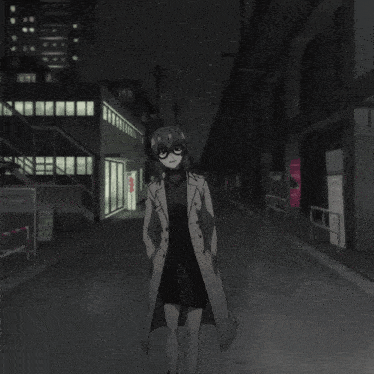

<!-- Banner local -->

  

<h1 align="center">¡Hola, soy <a href="https://github.com/Calabaza00">Calabaza00</a>! 👾</h1>

  <em>Estudiante de Ingeniería Informática — Perú.</em>

---

## 👤 Sobre mí
- 🎓 Estudiante de **Ingeniería Informática**
- 📚 Actualmente aprendiendo **C++**, **Python** y **Java**
- 🎯 Objetivo: **aprender siempre** y **mejorar cada día**
- 🎮 Me gustan los **videojuegos** y experimentar con nuevas tecnologías

---

## 🧰 Tecnologías y herramientas
<!-- Coloca los SVG en ./assets/icons/ con estos nombres -->

  
  
  
  
  
  
  

  

---

## 🚧 Proyectos
_Aún no hay trabajos destacados. Próximamente..._

---

## 🖼️ Estilo

  
  

---

## 📫 Contacto

  <a href="mailto:snowy.0wo9@gmail.com">📧 Email</a> •
  <a href="https://github.com/Calabaza00">🐙 GitHub</a>

---

> “La perseverancia es la clave del éxito.”
